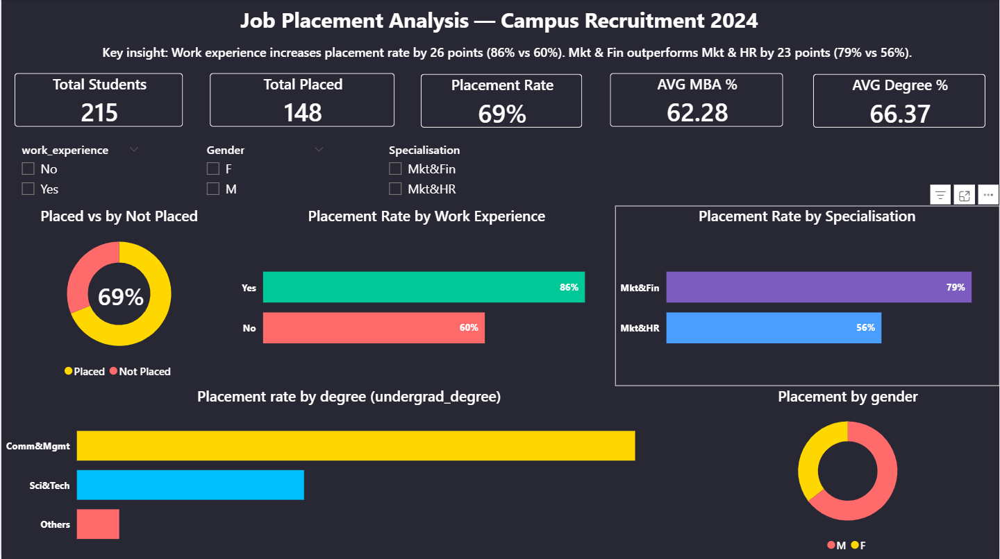

# job-placement-analysis
Campus placement analysis using SQL, Python and Power BI

## Business Question
What factors determine whether a fresh graduate gets hired?

## Tools Used
SQL (MySQL) | Python (Pandas) | Power BI

## Dataset
215 MBA students — campus placement data

## Key Findings
- Overall placement rate: 69% (148 out of 215)
- Work experience: 86% placement rate vs 60% without
- Mkt&Fin: 79% placement rate vs Mkt&HR 56%
- Comm&Mgmt graduates placed highest among all degrees

## Dashboard

## Files
- analysis.sql — 3 SQL queries
- placement_analysis.ipynb — Python cleaning
- clean_placements.csv — processed dataset
